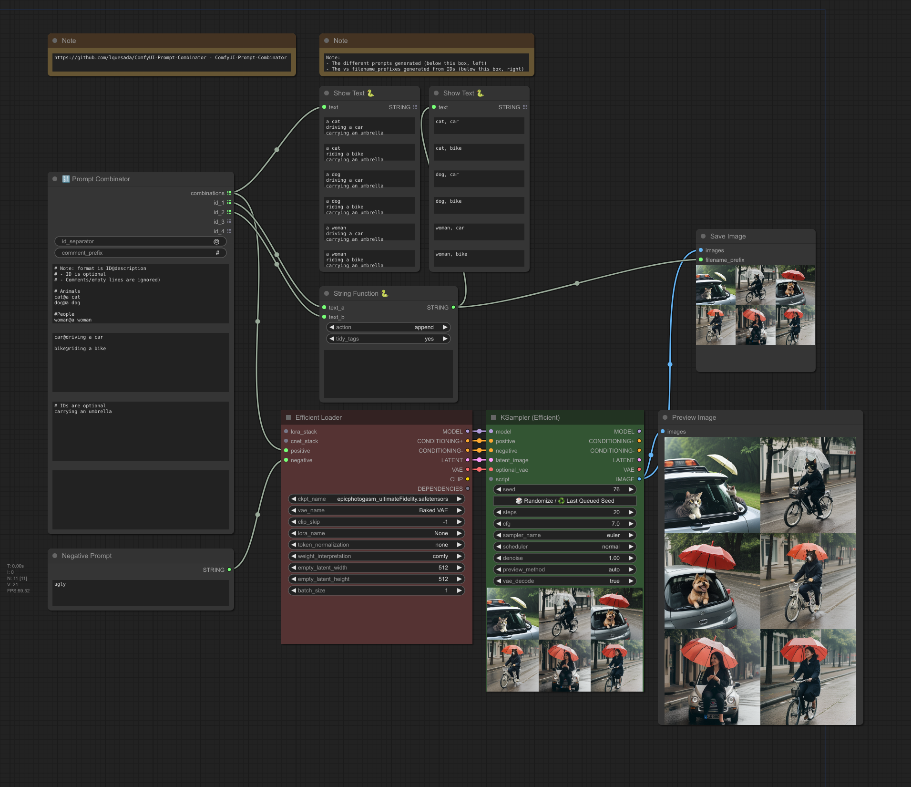

ComfyUI-Prompt-Combinator

Copyright (c) 2024, Luis Quesada Torres - https://github.com/lquesada | www.luisquesada.com

Check ComfyUI here: https://github.com/comfyanonymous/ComfyUI

# Overview

"🔢 Prompt Combinator" is a node that generates all possible combinations of prompts from several lists of strings.

"🔢 Prompt Combinator Merger" is a node that enables merging the output of two different "🔢 Prompt Combinator" nodes.

## Simple example
Download the following example workflow from [here](prompt-combinator_example_workflow.json) or drag and drop the screenshot into ComfyUI.



## Advanced example
Download the following example workflow from [here](prompt-combinator_example_workflow_advanced.json) or drag and drop the screenshot into ComfyUI.


# Installation Instructions

Install via ComfyUI-Manager or go to the custom_nodes/ directory and run ```$ git clone https://github.com/lquesada/ComfyUI-Prompt-Combinator.git```

# Detailed Use Case
You want to produce all possible combinations of prompts from several lists of strings, e.g.

**Input list 1:**
```
a cat
a dog
```

**Input list 2:**
```
with pointy ears
with fluffy tail
with two heads
```

**Input list 3:**
```
cute
scary
```

**Expected output:** a list of strings that contain
```
a cat
with pointy ears
cute

a cat
with pointy ears
scary

a cat
with fluffy tail
cute

a cat
with fluffy tail
scary

a cat
with two heads
cute

a cat
with two heads
scary

a dog
with pointy ears
cute

a dog
with pointy ears
scary

a dog
with fluffy tail
cute

a dog
with fluffy tail
scary

a dog
with two heads
cute

a dog
with two heads
scary
```

Additionally, you may want to be able to identify what inputs were used in order to craft the filename_prefix, e.g.:
cat, pointy-ears, scary_00001_.png
dog, two-heads, cute_00001_.png

This custom node serves this purpose.

# License
Creative Commons License Attribution-NonCommercial-ShareAlike 3.0 Unported (CC BY-NC-SA 3.0)

This is a human-readable summary of the Legal Code.

You are free:

*   to Share — to copy, distribute and transmit the work
*   to Remix — to adapt the work

Under the following conditions:

*   Attribution — You must attribute the work in the manner specified by the author or licensor (but not in any way that suggests that they endorse you or your use of the work).

*   Noncommercial — You may not use this work for commercial purposes.

*   Share Alike — If you alter, transform, or build upon this work, you may distribute the resulting work only under the same or similar license to this one.

With the understanding that:

*   Waiver — Any of the above conditions can be waived if you get permission from the copyright holder.
*   Public Domain — Where the work or any of its elements is in the public domain under applicable law, that status is in no way affected by the license.
*   Other Rights — In no way are any of the following rights affected by the license:
       Your fair dealing or fair use rights, or other applicable copyright exceptions and limitations;
       The author's moral rights;
       Rights other persons may have either in the work itself or in how the work is used, such as publicity or privacy rights.
*   Notice — For any reuse or distribution, you must make clear to others the license terms of this work. The best way to do this is with a link to this web page.

For details and the full license text, see http://creativecommons.org/licenses/by-nc-sa/3.0/
